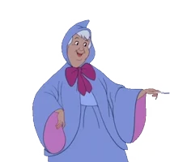
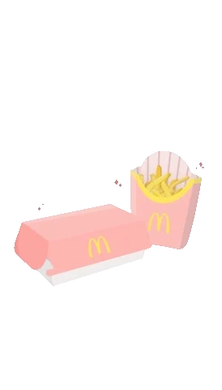

```{r setup, include=FALSE}
knitr::opts_chunk$set(echo = FALSE,warning=FALSE,message=FALSE)

library(tidyverse)


```
Here's my website, queen
```{r fig.align='center'}

```

## Here's some links 

[About me!](https://aimoneb.github.io/aboutme/)

[Something to make you not want to die :)](https://www.youtube.com/watch?v=roQGFJmd5Dc)


# you're welcome




