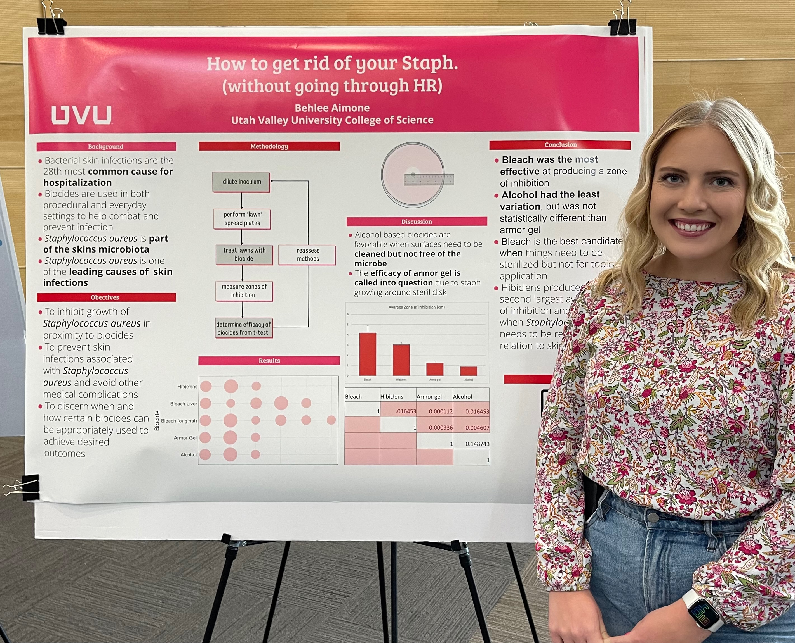
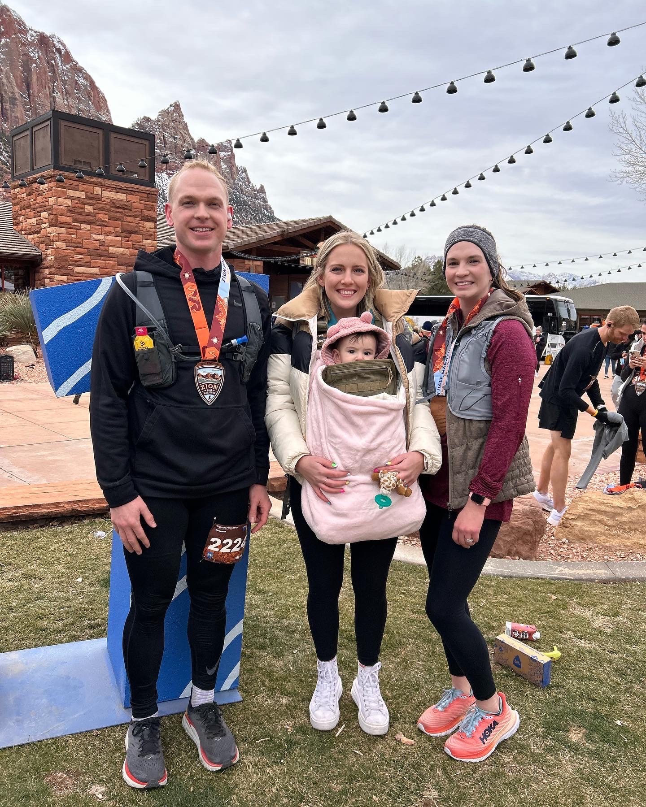
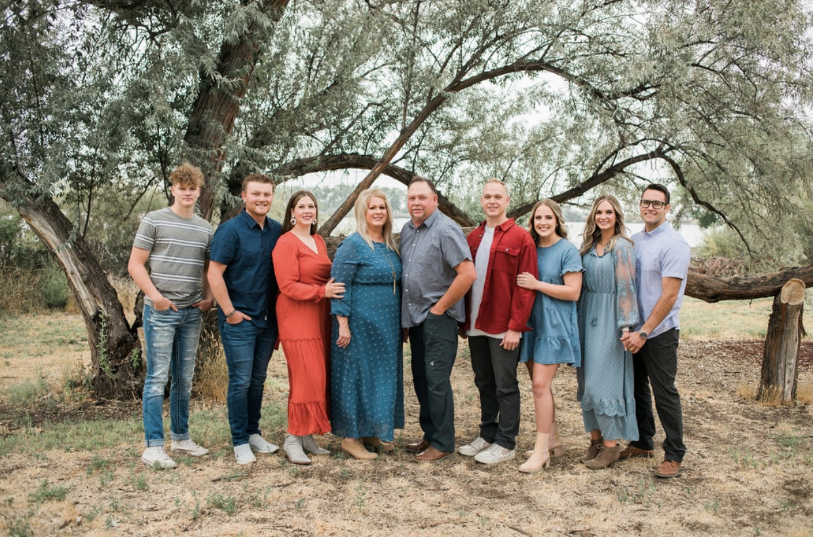
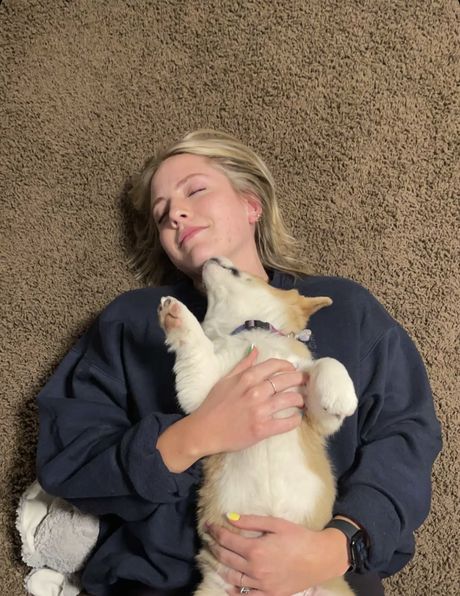
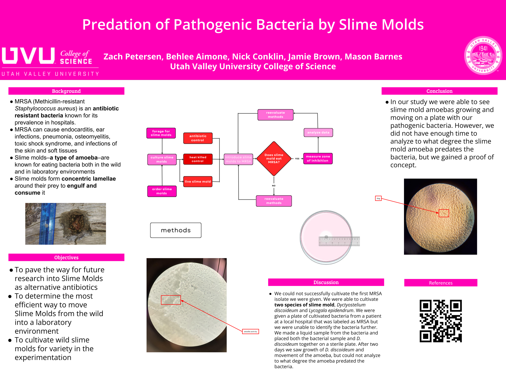
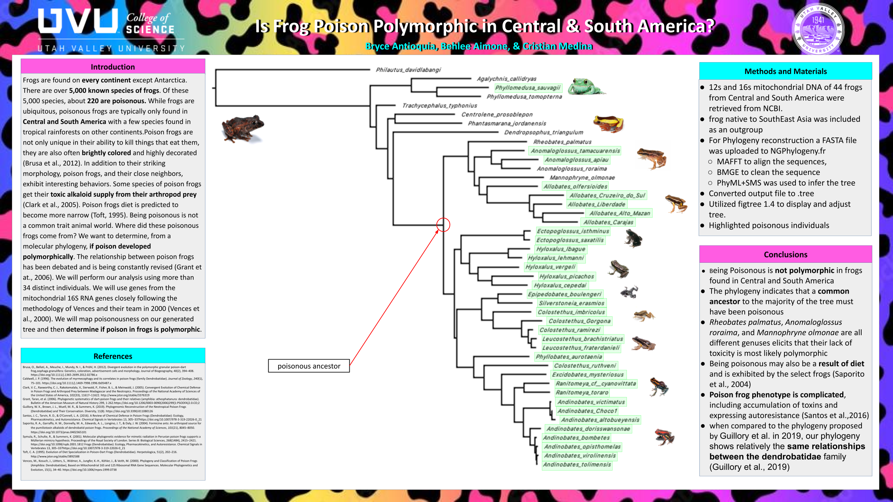
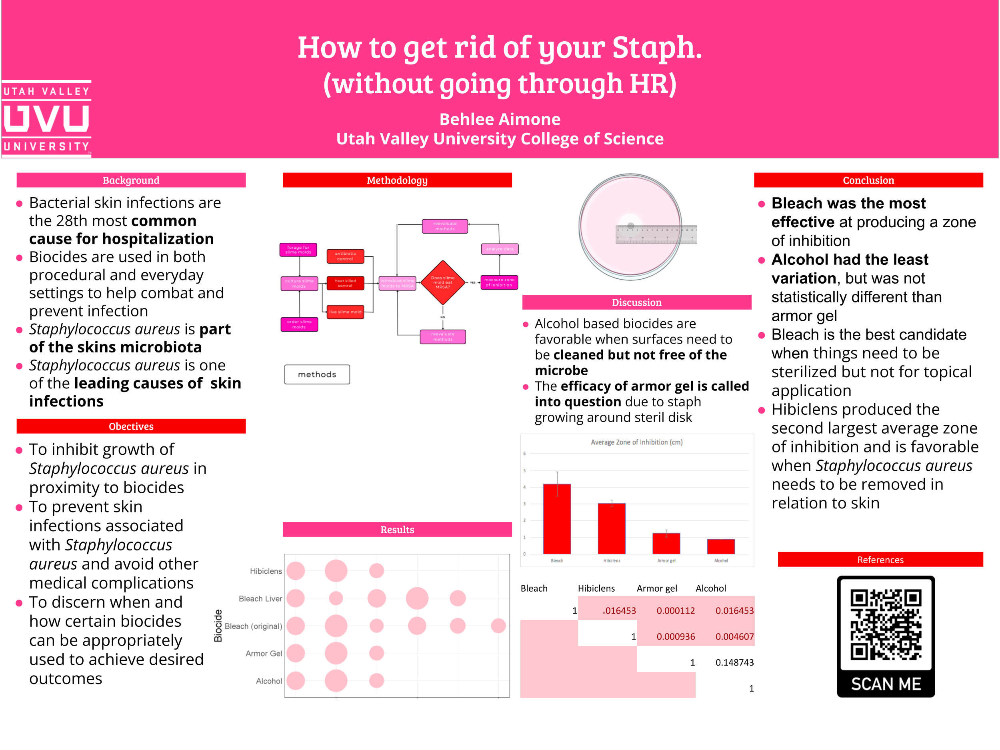
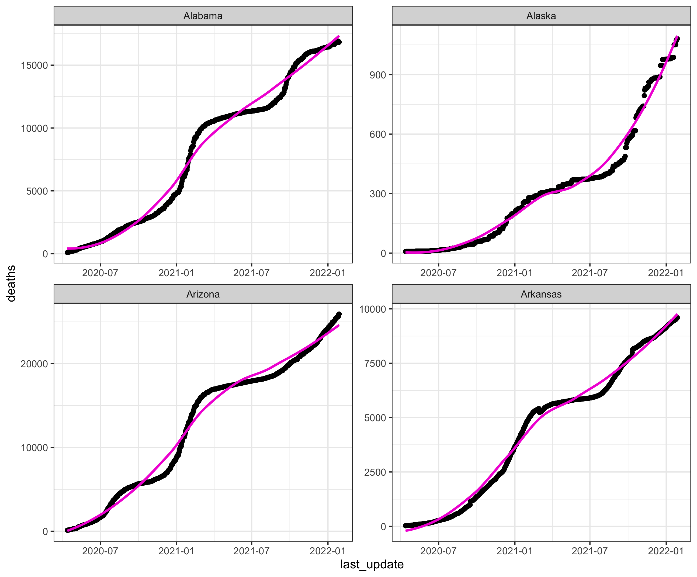
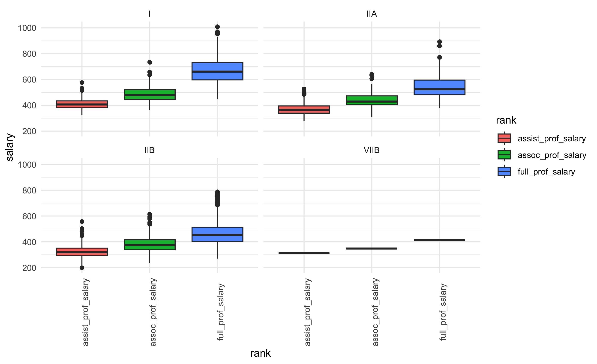

```{r setup, include=FALSE}
knitr::opts_chunk$set(echo = FALSE,warning=FALSE,message=FALSE)

library(tidyverse)
library(janitor)
library(stringr)
library(ggpubr)
library(broom)
library(AICcmodavg)
library(kableExtra)
```
# Behlee Aimone
```{r fig.align='center'}

```

## Contact: 

##### Phone: 307-780-5293
##### Email: behleeannaimone@yahoo.com

---

---

## About:

```{r fig.align='center'}




```

##### Hi, I'm Behlee; dog mom, lover of treats, bacteria, the office, JB, and the color pink! I grew up, the youngest of eight, on a family ranch in rural Wyoming (like seriously... RURAL) where I worked cattle, participated in sports and did normal kid things. I moved to the big city (Orem Utah) in 2018 right after I graduated high school to pursue my academic dreams at Utah Valley University. I found the love of my life in calculus and got married in August of 2019 (very Utah... I know) and continued to fall in love with Biology and all things science. During my time at UVU, I have been honored and privileged to work in two undergraduate research labs with Dr. [Lauren Brooks](https://www.uvu.edu/directory/employee/?id=NHdLS3JSbDE2NS9oZ29XR1k2cXlyUT09) and Dr. [Geoff Zahn](https://gzahn.github.io/). In both Dr. Brooks's and Dr. Zahn's labs I led funded research teams of undergraduates and presented our findings at local poster sessions. Peer mentoring and team-based learning have become passions of mine at UVU and have taught me that inclusivity and accessibility are the foundation of collaboration. I am excited to continue collaborating and working with others as I enter the workforce. 
##### I became passionate about data science after working with Dr. Zahn in his intro to r studio class. Since taking his class I have created a shiny app currently in use in the research labs at UVU and have actively participated in preparing a manuscript for publication on the microbiome of seagrass in South Asia. I experienced how fulfilling it is to work with complex data structures, use machine learning, scrape web data, do complex statistical analysis (MRM, NMDS, decision trees, etc.), and work on code collaboratively. Data analytics excites me. I love that it is an ever-changing field that is fast-paced and challenging. I am ready to continue improving my coding skills and learn innovative ways to utilize data because the future should be data-driven, and data tells stories if we have to tools to see them. 


---

---

## Personal links/code contributions:

[Git hub](https://github.com/aimoneb)

[Zenodo release](https://zenodo.org/record/7729694#.ZBT5-uzMKrM)

---

---

## Research Experience:

```{r}

```

#### SAC funded research on slime molds ability to consume and control pathogenic bacterial growth 

```{r}

```

#### Nucleotide analysis on the phylogenetic relationships of poison dart frogs in Central and South America
###### analysis performed using [NCBI,](https://www.ncbi.nlm.nih.gov/) [NGPhylogeny,](https://ngphylogeny.fr/) and [FigTree v1.4.4](https://github.com/rambaut/figtree)


```{r}

```

#### Sculpt funded research of biocide efficacy on <i> S. aurues </i>

###### analysis performed using R studio

---

---

## Output/Code examples: 
##### Here is a glimpse of a real-life data set about covid that I scraped and cleaned from the CDC
```{r}

covid_df<-read_csv("./data/cleaned_covid_data.csv") %>% clean_names()

head(covid_df) %>% kable() %>% 
  kable_classic(lightable_options = 'hover')
```
##### From this data set we can look at Covid trends by state
```{r}

```

##### We can rank states by their maximum fatality ratio
```{r}
state_max_fatality_rate<-covid_df %>% 
  group_by(province_state) %>% 
  summarise(maximum_fatality_ratio = max(case_fatality_ratio,na.rm = TRUE)) %>% 
  arrange(desc(maximum_fatality_ratio))

p1<-state_max_fatality_rate %>% 
  mutate(province_state = factor(province_state,levels = province_state)) %>% 
  ggplot(aes(x=province_state, y=maximum_fatality_ratio))+
  geom_col(fill= "#f205d7")+
  theme_bw()+
  theme(axis.text.x = element_text(angle = 90,hjust = 1))

plotly::ggplotly(p1)
```

##### And show the cumulative death toll over time (this plot is interactive if you scroll your cursor over the line)
```{r}
p<-covid_df %>% 
  group_by(last_update) %>% 
  summarise(totaldeaths = sum(deaths, na.rm = TRUE)) %>% 
  ggplot(aes(x=last_update, y =totaldeaths)) + 
  geom_point()+
  theme_bw()
plotly::ggplotly(p)
```

---

##### Analysis of a data set regarding faculty salaries 

```{r}
fac_dat<-read_csv("./data/FacultySalaries_1995.csv")
head(fac_dat)
```

###### This is not a "tidy" data set, so I can clean it by writing a function that can be used over and over
```{r}
fac_dat<-read_csv("./data/FacultySalaries_1995.csv") %>% clean_names() %>% 
  pivot_longer(c(ends_with("salary")), names_to = "rank", values_to = "salary",names_prefix = "avg_")%>%
  pivot_longer(c(ends_with("comp")), names_to = "comp_type", values_to = "comp_amt") %>% 
  pivot_longer(c(num_full_profs,num_assoc_profs,num_assist_profs), names_to ="faculty_type",
  values_to="faculty_count")

head(fac_dat) %>% kable() %>% kable_classic(lightable_options = 'hover')

```


###### Real-life data sets can be pretty hard to understand. It is my job to make them manageable to look at and informative!
```{r}


```

###### The most powerful tool a data analyst has (besides visualizing data), is modeling data to make predictions.  

```{r}

twoway<-aov(salary~state+rank+tier, data = fac_dat)
summary(twoway)
```
###### This is an ANOVA model which is a linear modeling method to evaluate the relationships between variables. It can rank the variables based on their impact on the outcome. We can use tools like this to identify variables to explore in making changes to our experiments, and workflow or to make predictions for the future. 


###### ANOVA is just one method of modeling. There are countless others that are readily usable with R studio. It is my job to use the objectivity of the data software to select the model that best fits each unique data set. 


